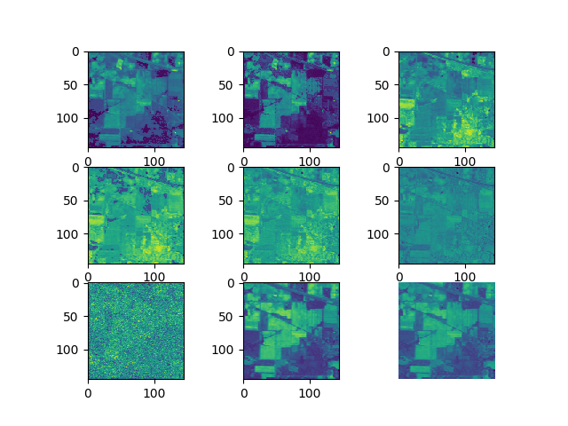

# Statlie image processor with BASS architecture

### Description

BASS stands for Band-Adaptive Spectral-Spatial, a parallel deep neural network architecture for classifing  hyperspectral images. The idea proposed by researchers from Indian Institute of Technology (<a href="https://arxiv.org/abs/1612.00144">paper</a> for details). Hyperspectral images possess a long spectral dimension, which potentially result in long training and inference time and enormous energy consumption during the computation. In this project, BASS-Net is re-written in TensorFlow and Keras, a Dataflow programming library and Deep learing framework developed by Google. The code is translated to FPGA instructions,in which Inference is completed using Nubula and Rainman FPGA boards from Corerain technologies, and training process is completed with NVIDIA TitanX Graphics processing unit. As such, training and inference time could be greatly reduce as well as using lesser power. This work will be adapted by industries for natural language processing and system verification in the future.  

Figure 1. Sample of Statlie image<br>


Figure 2. Sample of Indian Pine hyperspectral image<br>


### General Guidance

##### Requirement
1. Python2.7 and Python3.5 or Above
2. TensorFlow and Keras
3. Dependencies listed in requirement.txt

To install dependencies for this project, in your directory enter the following command, Please note that TensorFlow and Keras are not included.
```
pip install -r requirement.txt
```
* PS if the above command fails, use native pip to install the requirement instead


##### Repository structure
'preprocess' forms part of block 1 described in BASS-NET, it downloads/loads MATLAB image <a href="http://www.ehu.eus/ccwintco/index.php/Hyperspectral_Remote_Sensing_Scenes">data</a> and perform feature selection algorithm on the statlie image.
During the execution of this program, MATLAB files which consist of training data and labels, validation data and labels, testing data and labels will be created and save in 'data' folder.
Data and labels are in Tensor size (number_of_selected_features, feature_height, feature_width, bands ) and (number_of_selected_features, number_of_class)

To run preprocess_big.py, run the following command. Available data options are Salinas, Indian_pines, KSC, Botswana, add '--size small' in the command for a smaller training model
```
python2 preprocess_big.py --data Indian_pines
```

'BASS_netbyTF' is the implementation of BASS-NET in TensorFlow description. 
* PPS Block 1 and Block 3 have been implemented, however Block 2 is current placed by just one convolutional layer. Details parameters are not yet finalised.

```
python3 bass_netByTF.py
```

<br>
